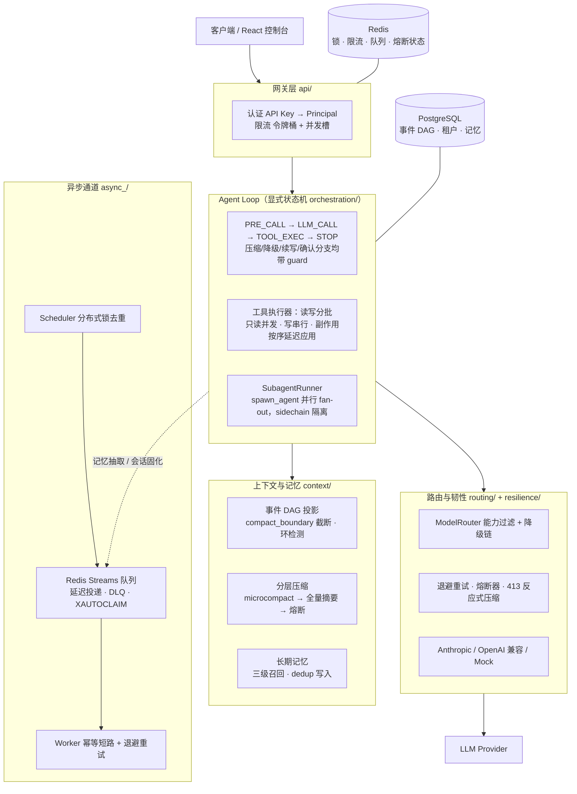

# AgentGate

> **AI Agent 网关与运行时** —— 把「裸调 LLM API」升级为一个生产级 Agent 底座：
> 会话事件溯源、工具并发治理、上下文自动压缩、Provider 降级熔断、长期记忆与技能激活、子 Agent 并行委派，全部开箱即用。
> 
> 

## 为什么需要 AgentGate？

| 裸调 API 的问题 | AgentGate 的方案 |
|---|---|
| 对话历史线性堆积，无法回放/分支/审计 | **事件 DAG**：父指针 + 逻辑父指针双链，纯函数投影，支持压缩边界与 sidechain 隔离 |
| 工具并行调用产生副作用竞态 | **读写分批执行器**：只读工具并发、写工具串行，副作用延迟到批末按模型原始顺序应用 |
| 长对话超出上下文窗口就崩 | **分层压缩**：microcompact（占位化旧工具结果，保住 prompt cache）→ 全量摘要 + 熔断防死循环 |
| Provider 过载/截断/超时直接报错 | **韧性链**：指数退避重试 → 熔断器 → 模型降级链 → 截断续写，每条恢复路径带上限 guard |
| 危险操作模型说了就做 | **两段式关卡**：dangerous 工具挂起会话，人工批准/拒绝后恢复 |
| 每会话从零开始，没有记忆 | **长期记忆**：`remember` 工具 + 三级廉价召回（索引扫描 → 关键词粗排 → 小模型精选），无向量库依赖 |
| 提示词一改缓存全失效 | **分层 Prompt 组装**：静态前缀带版本号求缓存 hash，动态块不破坏缓存前缀 |
| 复杂任务只能单线程磨 | **子 Agent fan-out**：`spawn_agent` 并行委派，独立工具集收紧权限，中间过程不污染父上下文 |
| 多 agent 一跑就失控：无限递归、成本不可见、子 agent 绕过 scope | **委派治理四道闸**：深度/扇出/token 预算/fleet 并发，能力只减不增（写进类型），整棵子树用量并进父账，`subagent` 事件实时可见 |

## 架构总览



**设计基调**：时钟、随机源、存储全部依赖注入 —— 熔断/退避/限流/认证/队列/记忆召回都是纯逻辑，**离线单测不起 DB/Redis/LLM**；接线层只做装配与 HTTP 映射。

## 快速开始（Docker 一键起）

```bash
git clone https://github.com/ttk-tong/AgentGate.git && cd AgentGate
docker compose up -d --build
```

启动服务列表：

| 服务 | 地址 | 说明 |
|---|---|---|
| **app** | http://localhost:8000 | API（`/docs` Swagger，dev 自动建表） |
| **worker** | — | 异步任务消费 + 定时调度 |
| postgres / redis | 5432 / 16379 | 存储 |
| prometheus | http://localhost:9090 | 指标 |
| grafana | http://localhost:3001 | 仪表盘（admin/admin，已预置 AgentGate dashboard） |

**无需任何 API Key 即可跑通**：不配置 Provider 凭证时自动用 Mock 回声模型。要接真实模型，导出环境变量后重启：

```bash
export ANTHROPIC_API_KEY=sk-ant-...          # Anthropic 原生
# 或 OpenAI 兼容端点（如 DeepSeek）：
export OPENAI_BASE_URL=https://api.deepseek.com/v1 OPENAI_API_KEY=sk-...
docker compose up -d app worker
```

### 30 秒对话冒烟

```bash
# 1. 建会话
SID=$(curl -s -X POST localhost:8000/v1/sessions \
  -H 'Content-Type: application/json' -d '{"external_user":"demo"}' | python -c "import sys,json;print(json.load(sys.stdin)['session_id'])")

# 2. 发消息（非流式；流式加 /stream 走 SSE）
curl -s -X POST localhost:8000/v1/sessions/$SID/messages \
  -H 'Content-Type: application/json' -d '{"content":"你好，介绍一下你自己"}'

# 3. 触发工具调用（Mock 模型支持脚本语法）
curl -s -X POST localhost:8000/v1/sessions/$SID/messages \
  -H 'Content-Type: application/json' -d '{"content":"[[tool:weather city=Beijing]]"}'
```

### 认证与多租户（生产形态：B2B 每客户一套 key）

**隔离模型**：一个企业客户 = 一个 **租户（tenant）**，给它签发一把（或多把可轮转的）API Key。客户后端持有 key，代自己的终端用户调用；终端用户标识放进 `external_user`，仅用于会话归属 / 记忆隔离 / 审计，**不参与鉴权**——租户隔离由 `tenant_id` 硬校验保证，session_id 泄露也调不动别的租户的会话。

> **隔离边界是租户，不是 key，也不是 `external_user`。** 跨租户一律拒绝（硬保证）；但**同一租户内**的多把 key、不同 `external_user` 之间**不互相隔离**——session_id，若泄露给同租户的另一把有 `sessions:*` 权限的 key，是可以访问的。这符合 B2B 场景（key 由客户后端持有，租户内会话本就归该客户统一管理）。

dev 默认 `AUTH_REQUIRED=false` 匿名放行（所有人归一个匿名租户，仅供本地调试）。compose 里 app 服务已默认 `AUTH_REQUIRED=true`，即生产形态；临时敞开用`AUTH_REQUIRED=false docker compose up -d app`。

**管理接口**（`/v1/admin/*`，全部要求 `admin:*` scope，禁止签发特权 key，杜绝租户自助提权）：

| 方法 | 路径 | 说明 |
| --- | --- | --- |
| `POST` | `/v1/admin/tenants` | 开通企业客户（租户）+ 限流配额 |
| `POST` | `/v1/admin/tenants/{tid}/keys` | 给租户签发 key（明文只返回一次） |
| `GET` | `/v1/admin/tenants/{tid}/keys` | 列 key（不含明文/哈希，供轮转决策） |
| `DELETE` | `/v1/admin/tenants/{tid}/keys/{kid}` | 吊销 key（软删除，认证层即时拒绝） |

```bash
# 0. 引导一把平台 admin key（一次性；只落哈希，明文只打印这一次）
docker compose exec app python -m scripts.seed_api_key \
  --tenant-name platform-admin --scopes "admin:*"
ADMIN="ak_..."   # 保存

# 1. 开通企业客户（租户）+ 配额
TID=$(curl -s -X POST localhost:8000/v1/admin/tenants \
  -H "Authorization: Bearer $ADMIN" -H 'Content-Type: application/json' \
  -d '{"name":"Acme","qps":10,"burst":20}' | tr -d '{}"' | sed 's/.*tenant_id://;s/,.*//')

# 2. 给它签发一把业务 key（scope 限 sessions:*，发不了 admin:*）
curl -s -X POST localhost:8000/v1/admin/tenants/$TID/keys \
  -H "Authorization: Bearer $ADMIN" -H 'Content-Type: application/json' \
  -d '{"scopes":["sessions:write"],"name":"acme-prod"}'
# → {"api_key":"ak_...", ...}  明文只此一次，交给客户

# 3. 客户用这把 key 调用；终端用户标识放 external_user
curl -s -X POST localhost:8000/v1/sessions \
  -H "Authorization: Bearer <客户key>" -H 'Content-Type: application/json' \
  -d '{"external_user":"acme-user-42"}'

# 4. 轮转：发新 key → 客户切换 → 吊销旧 key（下一次请求即 401）
curl -s -X DELETE localhost:8000/v1/admin/tenants/$TID/keys/<旧KID> \
  -H "Authorization: Bearer $ADMIN"
```

密钥安全设计：`ak_<prefix>_<secret>` 格式，服务端只存 `sha256(salt+secret)` 哈希 + 明文prefix；验证走常量时间比对；跨租户访问硬校验拒绝；吊销/过期即时生效。超限返回`429 + Retry-After`（令牌桶精确计算补足时间）。

### 前端控制台（可选）

```bash
cd web && npm install && npm run dev   # http://localhost:3000
```

### 本地开发（不走 Docker）

```bash
docker compose up -d postgres redis
python -m venv .venv && .venv/Scripts/python.exe -m pip install -e ".[dev]"   # Windows
cp .env.example .env
.venv/Scripts/python.exe -m alembic upgrade head
.venv/Scripts/python.exe -m pytest -q                                        # 全部离线可跑
.venv/Scripts/python.exe -m uvicorn app.main:app --reload
```

## 性能与可观测

单机压测（Mock provider，详见 [`ops/benchmark.md`](ops/benchmark.md)，含缺陷定位与修复过程）：

- 流式对话首 Token（TTFB）**P50 ~25ms**
- 创建会话 50 并发：~30 req/s，P95 1.56s，**零错误**
- 限流精确性：超 `max_concurrency` 精确 429 + Retry-After，无误放行
- 压测暴露并修复两个真实缺陷：Redis 连接无超时阻塞主链路（4100ms → 100ms）、DB 连接池默认过小

可观测三件套：structlog 结构化日志（trace_id 贯穿）+ Prometheus 指标（HTTP/Agent/工具/Provider/队列五组，路由模板做 label 防高基数爆炸）+ Grafana 预置仪表盘与告警规则。

## 测试

19 个测试文件、约 2800 行。核心策略：**纯逻辑离线测**（投影/分批/压缩规划/退避/熔断/限流/认证/队列/记忆/技能/Prompt 组装，不起任何外部依赖）+ **关键链路端到端**（对话、工具确认、压缩、恢复路径，起 PG/Redis）。CI 跑 ruff + mypy + Alembic 迁移校验 + pytest（带覆盖率报告）。

```bash
pytest -q --cov=app --cov-report=term-missing
```

## 目录结构

```
app/
├── api/            # 路由 + 认证/限流/trace 中间件
├── orchestration/  # Agent Loop 状态机、工具执行器、子 Agent、Prompt 组装、技能
├── context/        # 事件 DAG 投影、分层压缩、tokenizer、长期记忆
├── routing/        # ModelRouter + Provider 适配器（Anthropic / OpenAI 兼容 / Mock）
├── resilience/     # 退避、熔断、限流（纯逻辑，时钟/随机注入）
├── security/       # API Key 生成/验证、Principal、scope 鉴权
├── async_/         # 队列（Redis Streams）、Worker、Scheduler、分布式锁
├── persistence/    # SQLAlchemy 异步引擎、ORM 表、Redis 客户端
├── domain/         # 跨层领域模型（事件/工具/记忆/技能/子Agent）
└── observability/  # structlog + trace + Prometheus 指标
web/                # React 控制台（Vite + Tailwind）
alembic/            # 数据库迁移
ops/                # Prometheus/Grafana 配置 + 压测报告
scripts/            # API Key 签发等运维脚本
tests/              # 离线单测 + 端到端
```

## 设计细节（分阶段实现记录）

<details>
<summary><b>阶段 1：事件 DAG + 最小 Loop</b></summary>

不带工具的对话端到端闭环（walking skeleton）：

- **DAG 投影**（`context/projection.py`）：父指针回溯 + `compact_boundary` 截断 + 按 `message_id` 归并并行兄弟节点 + 环检测 + sidechain 排除。纯函数，单测覆盖。
- **Provider 适配器**（`routing/providers/`）：Anthropic 流式 SSE 解析；无 API key 时用 Mock，保证无网络也能跑通。
- **最小 Agent Loop**（`orchestration/agent_loop.py`）：显式状态机 `PRE_CALL → LLM_CALL → STOP → DONE`，命名转移与恢复 guard 字段一步到位。
- **会话串行锁**（`orchestration/session_lock.py`）：`lock:session:{id}`，Redis SET NX + Lua 校验释放。

</details>

<details>
<summary><b>阶段 2：工具（读写分批 + 人工确认）</b></summary>

- **工具契约**（`domain/tool.py`）：`ToolSpec`（`is_read_only` / `is_concurrency_safe` / `mutates_context` / `dangerous`）+ 三段式执行体（模型面校验 / 系统面权限 / 执行）+ `ContextMutation`。
- **读写分批执行器**（`orchestration/tool_executor.py`）：连续只读工具并成「可并发批」、写/未知/不安全工具单独串行批；并发批的 `ContextMutation` **延迟到批结束后按模型原始调用顺序串行应用**，避免竞态。
- **两段式关卡**：`dangerous` 工具挂起会话为 `waiting_confirmation`，`POST /v1/sessions/{id}/confirmations` 批准/拒绝后恢复运行。

</details>

<details>
<summary><b>阶段 3：上下文管理（分层压缩）</b></summary>

- **Token 计量 + 预算**：轻量启发式估算（中英分别校准，宁大勿小）；`compact_threshold = 有效窗口 - BUFFER`。
- **microcompact**（日常主力）：白名单只读工具的旧结果占位化、token 归零。语义可逆、不改父指针、不重排消息 → **保住 prompt cache**。
- **全量摘要 + `compact_boundary`**：九段式结构化摘要；边界事件 `parent_id=None` 切断前史、`logical_parent_id` 保留真实指向供回放审计。
- **失败熔断**：摘要失败累计达 `max_compact_failures` 熔断退出，不死循环；413 反应式压缩带一次性 guard。

</details>

<details>
<summary><b>阶段 4：韧性（恢复路径 + 认证限流）</b></summary>

- **认证/鉴权**（`security/`）：API Key 哈希存储 → `Principal`；scope 校验 + 租户隔离硬校验。
- **多租户管理**（`api/v1/admin.py`）：`admin:*` 保护的 `/v1/admin/tenants[/{tid}/keys]` 发/列/吊 key，白名单禁签 `admin:*`（防租户自助提权）；吊销软删除即时生效。B2B 每客户一租户，`external_user` 承载客户内部终端用户标识（不参与鉴权）。
- **重试/熔断/降级链**（`resilience/`）：指数退避 + 抖动 + Retry-After；每 Provider 熔断器（CLOSED→OPEN→HALF_OPEN）；降级链耗尽映射 503。
- **Loop 恢复路径**：过载 → 模型降级重跑；`max_tokens` 截断 → 升限续写；**错误抑制**——首字节前失败可安全重跑，已产出 token 后以 error 帧收尾不吞流。每条路径带上限 guard。
- **限流**：租户 QPS 令牌桶（Redis Lua 原子）+ 并发槽位（异常路径也释放，TTL 兜底）。

</details>

<details>
<summary><b>阶段 5：异步能力（队列 + Worker + 调度）</b></summary>

- **队列抽象**（`async_/queue.py`）：`InMemoryQueue`（离线测试）与 `RedisStreamsQueue`（消费者组 + `XAUTOCLAIM` 回收崩溃 Worker 的消息；延迟消息走 ZSet 到点搬运）。
- **Worker**：幂等短路（`idempotency_key` + `DoneStore`）→ 执行 → 可重试错误退避重排 → 超限进 **DLQ**。
- **Scheduler**：`fire_job` 抢分布式锁（SET NX PX）才入队，多实例同一 cron 只触发一次。

</details>

<details>
<summary><b>阶段 6：记忆 + 技能 + 提示词分层</b></summary>

- **记忆基线**：**不上向量库**。三级廉价召回：索引头部扫描 → 关键词 + 重要度粗排（零 LLM 成本）→ 候选过多才用小模型精选 top-k。写入按 `dedup_key` 去重。scope 三级隔离防跨用户泄漏。
- **提示词分层组装**：静态前缀（带版本号）在前、动态块在后；对 cacheable 块求 `sha256` 缓存前缀 hash —— 静态不变则命中 Provider prompt cache。外部内容统一 `<memory>` 边界包裹声明「仅为数据」，纵深防注入。`debug()` 支持 dry-run 观测。
- **技能加载**：扫描 `SKILL.md`（极简 front-matter，不引 YAML 依赖）；两级激活（trigger 关键词 → 小模型裁决）+ scope 过滤 + `MAX_ACTIVE` 上限。

</details>

<details>
<summary><b>阶段 7：子 Agent（隔离 + fan-out）</b></summary>

- **隔离执行体**：`SubagentRunner` 跑受限完整子 Loop——独立工具集（`allowed_tools` **替换而非合并**父工具集）、独立事件流（不落父 DAG），只回传最终文本。
- **并行 fan-out**：`spawn_agent` 标记 `is_read_only + is_concurrency_safe` → 执行器自动把多个调用归入同一并发批并行。
- **sidechain 语义**：子过程标记事件不改父 head，投影自动跳过——中间过程不污染父 LLM 上下文，但保留审计。

</details>

<details>
<summary><b>阶段 8：多 Agent 治理（栈深保护 + 成本可见）</b></summary>

设计与分期计划见 [`.claude/plan/12-multi-agent.md`](.claude/plan/12-multi-agent.md)。核心定位：**子 agent 是「LLM 层面的函数调用」，属于上下文管理，不是编排框架**——压缩是垃圾回收（事后清理已进主堆的垃圾），子 agent 是栈帧回收（垃圾从不进主堆）。

本阶段（M1）先把阶段 7 的地基做对。四个缺陷由离线探针实测确认，不是代码审查推断：

| 缺陷 | 实测证据 | 修法 |
|---|---|---|
| 递归无上限 | 子 agent 能看到 `spawn_agent`，探针跑出 **6 层嵌套** | `FleetGovernor` 深度闸，深度随 `ToolContext.agent_depth` 逐层递增（旧版存在 runner 上，全树共用一个实例，所以孙 agent 也报 depth=1） |
| 子 agent 绕过 MCP scope 校验 | 子 `ToolContext` 实测为 `tenant_id='' trace_id='' granted_scopes=[]`，而 MCP 代理把空 scope 当「未注入 → 不设卡」放行 | `AgentRunContext.child()` 是**唯一**派生途径且强制与父求交——能力放大在结构上不可能 |
| 成本完全不可见 | 子 agent 实测烧 1234 进 / 567 出，父 `usage` 报告 **0** | 每轮扣减全树共享的 `TokenBudget`；整棵子树用量随返回值并进父账 |
| fan-out 并发写同一 `AsyncSession` | 旧版子 agent 自己 `append_event`，N 个并发子 agent 共用请求作用域的同一个 session | 审计 trace 改走 `ContextMutation`，由父 loop 在批末**按模型原始调用顺序**串行落库 |

- **四道闸**（深度 / 扇出 / 预算 / fleet 并发）：与「每条恢复路径都带 guard」是同一条铁律的树版本。判定放在 `check_permissions`——`deny` 会被执行器折成 error 结果回填，模型看得懂并会改策略。
- **流式可见**：`subagent` 事件（started/finished/failed/denied）在**工具批执行期间**就流出去，不用等一次 300 秒的 fan-out 跑完；配 5 个 Prometheus 指标回答观测四问「扇出几个 / 烧了多少 / 跑了多久 / 多深」。
- **韧性对等**：抽出 `llm_call` 让父子共用退避重试 + 熔断；子上下文超限走内存版 microcompact（占位化最旧工具结果，一次性 guard）。
- **dangerous 工具在子 agent 侧直接从工具集滤掉**：子 loop 状态只在内存，挂起-确认无从恢复。
- ⚠️ **行为收紧**：`SUBAGENT_MAX_DEPTH` 默认 1，嵌套派发会被明确拒绝（阶段 7 是无限）。放宽应等 M2 的 `delegates_to` 清单白名单落地。

后续：M2 清单化 agent（`AGENT.md` + 结构化输出）、M3 拓扑（接力 / 汇总 / 显式编排 API）。

</details>

## License

[MIT](LICENSE)
